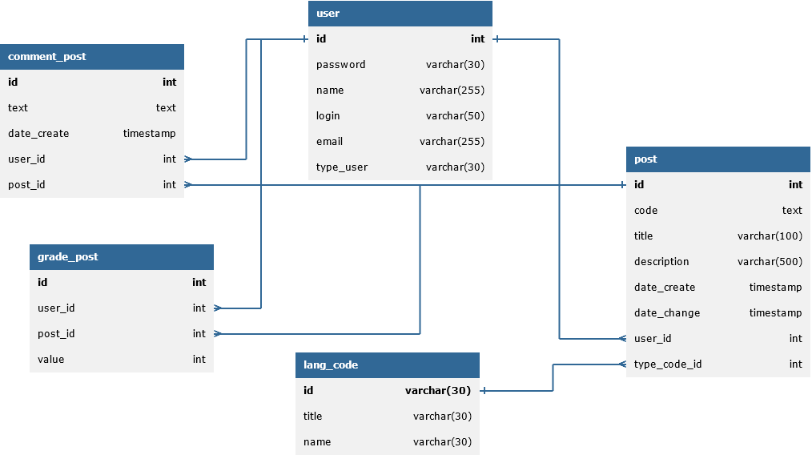

# CodeStorage

### CodeStorage - монолитное spring-boot приложение, использующее basic авторизацию.

---

<b>Структура проекта</b>

---
### Для работы в пользовательском режиме есть приложение CodeViewer(Десктопное JavaFX приложение)

### Назначение:

- Добавление постов кода с описанием.
- Просмотр постов
- Комментирование постов
- Оценка постов.

<b>Описание функционала программы</b>

1. Пользователи делятся на 3 категории
   - Незарегистрированные
   - Зарегистрированные
   - Администраторы

### Для полноценной работы необходимо зарегистрироваться или пройти аутентификацию

### Незарегистрированные пользователи могут:
1. Просматривать посты
2. Просматривать комментарии к постам

### Зарегистрированные пользователи могут:
1. Просматривать посты
2. Создавать посты
3. Редактировать ТОЛЬКО свои посты
4. Оценивать посты
5. Просматривать комментарии к постам
6. Добавлять комментарии к постам

### Администраторы могут:
1. Просматривать посты
2. Создавать посты
3. Редактировать ЛЮБЫЕ посты
4. Удалять ЛЮБЫЕ посты
5. Оценивать посты
6. Просматривать комментарии к постам
7. Добавлять комментарии к постам

#### Стек-технологий, используемый в приложении:
- Java 17
- Spring Boot 3.1.4
- - Hibernate
- - JdbcTemplate
- - Security(Basic Authentication)
- Maven
- Lombok
- PostgreSQL

